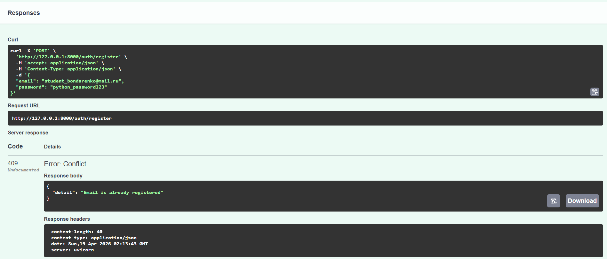
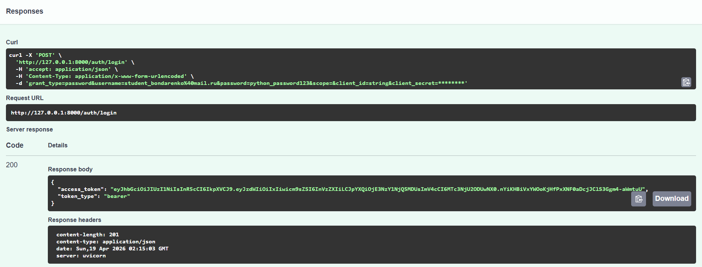
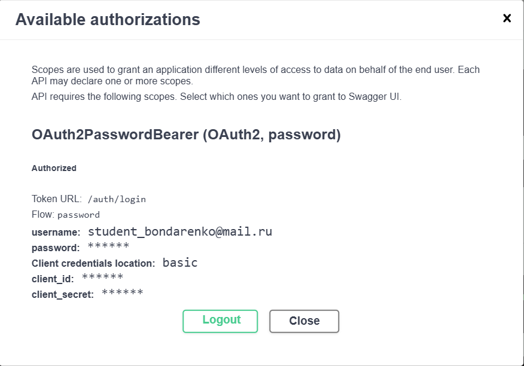
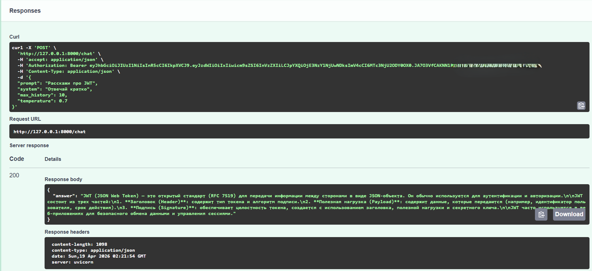
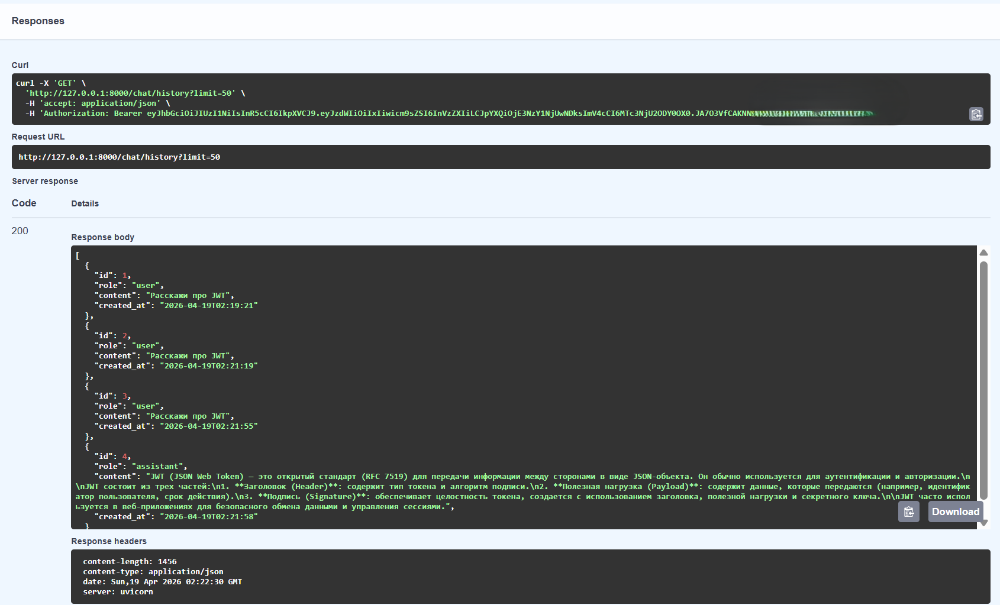
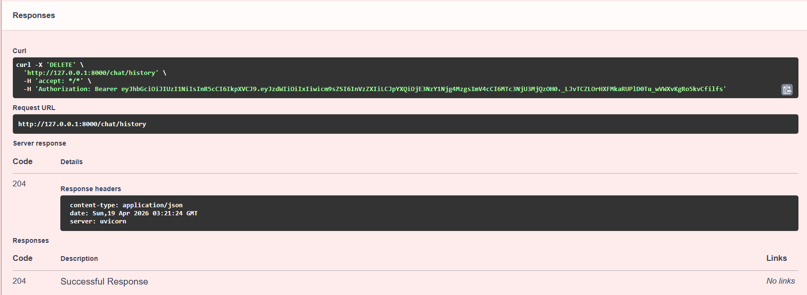

# llm-p

## Описание проекта

Серверное приложение на FastAPI, реализующее защищённый API для взаимодействия с большой языковой моделью (LLM) через сервис OpenRouter.

В проекте реализованы:

* регистрация и аутентификация пользователей (JWT),
* хранение данных в SQLite,
* взаимодействие с внешним API (OpenRouter),
* сохранение истории диалога,
* архитектура с разделением ответственности (API → UseCases → Repositories → Services → DB).

## Архитектура

Проект построен по принципу разделения слоёв:

* API (routes) — обработка HTTP-запросов
* UseCases — бизнес-логика
* Repositories — работа с базой данных
* Services — интеграция с внешними API (OpenRouter)
* DB — модели и подключение к базе

## Стек технологий
* FastAPI
* SQLAlchemy (async)
* SQLite
* JWT (python-jose)
* passlib (bcrypt)
* httpx
* uv (менеджер окружения)
* ruff (линтер)

## Установка и запуск
1. Установка uv  
* pip install uv
2. Инициализация проекта
* uv init
* uv venv
3. Активация окружения
* Windows:
.venv\Scripts\activate
* Linux / macOS:
source .venv/bin/activate
4. Установка зависимостей
* uv pip compile pyproject.toml -o requirements.txt
* uv pip install -r requirements.txt
5. Настройка переменных окружения  
Создать файл .env в корне проекта:

APP_NAME=llm-p  
ENV=local

JWT_SECRET=super_secret_key_123  
JWT_ALG=HS256  
ACCESS_TOKEN_EXPIRE_MINUTES=60  

SQLITE_PATH=./app.db

OPENROUTER_API_KEY=ВАШ_API_KEY  
OPENROUTER_BASE_URL=https://openrouter.ai/api/v1  
OPENROUTER_MODEL=openai/gpt-4o-mini  
OPENROUTER_SITE_URL=https://example.com  
OPENROUTER_APP_NAME=llm-fastapi-openrouter  

6. Запуск сервера  
uv run uvicorn app.main:app --reload --host 0.0.0.0 --port 8000

Swagger будет доступен по адресу:  
http://127.0.0.1:8000/docs

## Аутентификация

Используется JWT:

1. Пользователь регистрируется
2. Логинится и получает access_token
3. Токен используется для доступа к защищённым эндпоинтам
4. Авторизация происходит через кнопку Authorize в Swagger

## Эндпоинты API
### Auth
POST /auth/register  

Регистрация пользователя

POST /auth/login

Логин

GET /auth/me

Получение текущего пользователя

### Chat
POST /chat

Отправка запроса к LLM

GET /chat/history

Получение истории диалога

DELETE /chat/history

Очистка истории

### Health
GET /health

Проверка состояния сервера

Пример запроса к чату  
{  
  "prompt": "Объясни простыми словами, что такое JWT",  
  "system": "Отвечай кратко",  
  "max_history": 10,  
  "temperature": 0.7  
}

## Скриншоты работы
### Регистрация пользователя

### Логин и получение JWT

### Авторизация в Swagger

### Вызов POST /chat

### Получение истории через GET /chat/history

### Удаление истории через DELETE /chat/history

## Проверка кода
ruff check .

Результат:  

All checks passed!

## Вывод

Реализовано backend-приложение:

* c авторизацией
* работой с базой данных
* интеграцией с LLM

Проект готов к дальнейшему расширению.